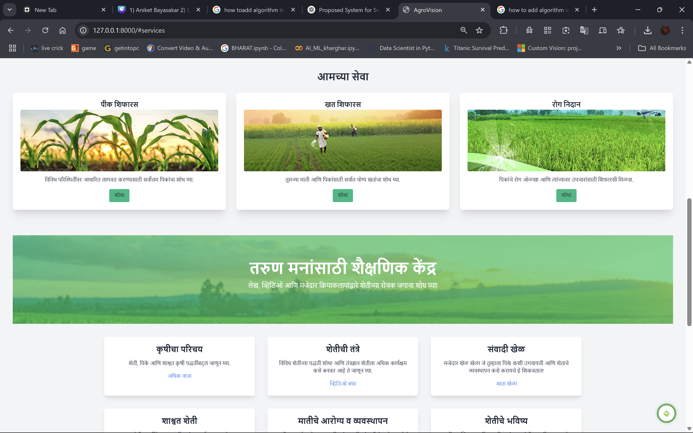
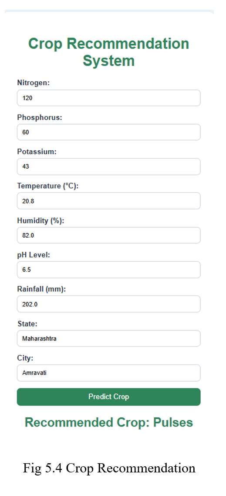
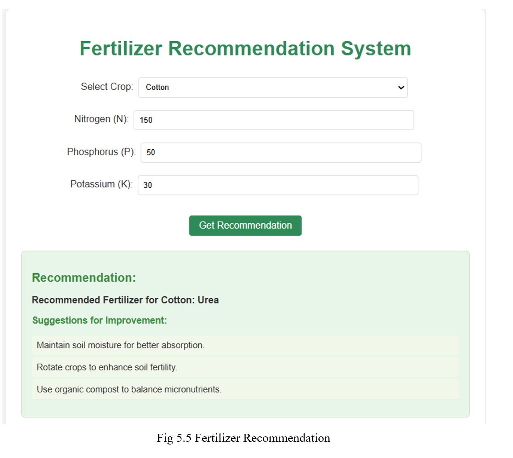
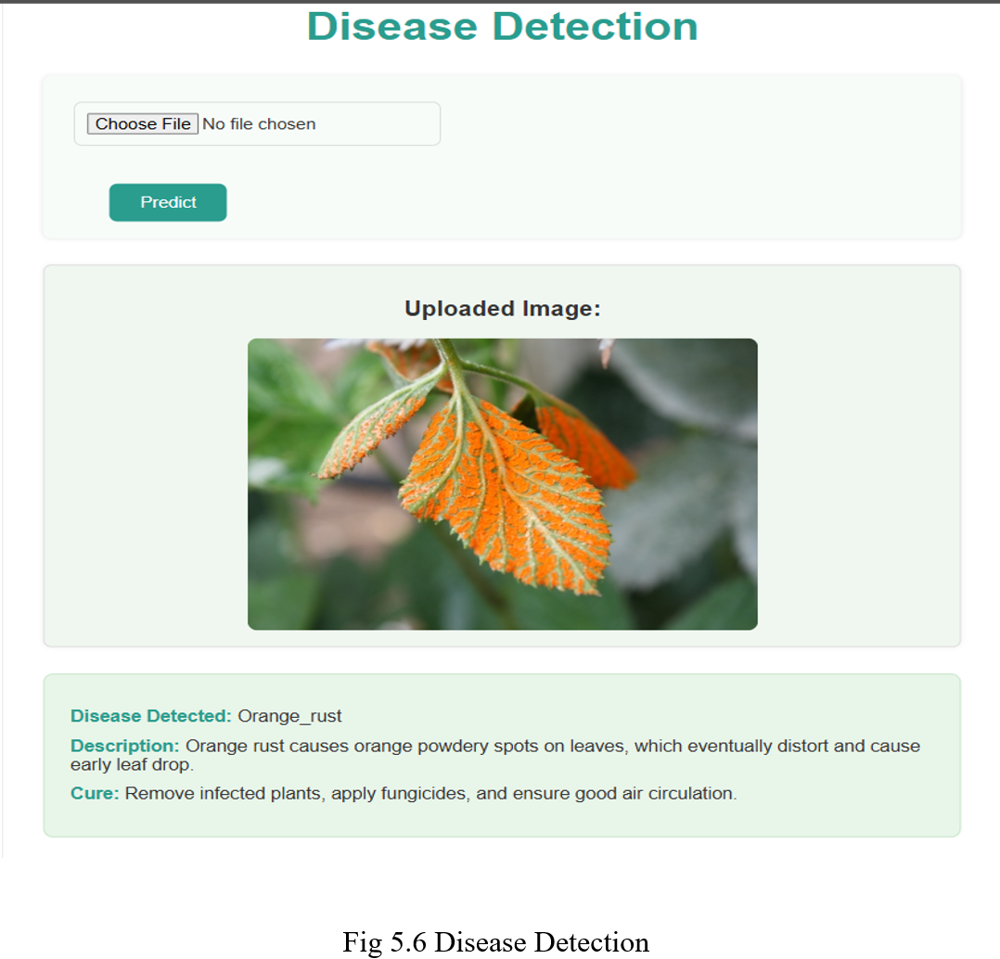

# 🌾 Smart Farm - AI Powered Precision Agriculture System

**Smart Farm** is an intelligent agriculture assistant powered by Machine Learning. It helps farmers make better decisions through crop recommendation, fertilizer suggestions, disease detection, and live market price tracking — all with support for regional languages like **Marathi** and **Hindi**.



---

## 🚀 Features

- 🌱 **Crop Recommendation**  
  Suggests the most suitable crop based on soil nutrients, temperature, humidity, pH, and rainfall using a **Random Forest** model.

- 🧪 **Fertilizer Recommendation**  
  Recommends the ideal fertilizer for your crop and soil condition with a Random Forest classifier.

- 🦠 **Disease Detection**  
  Detects plant diseases from leaf images using OpenCV and a trained Random Forest model.

- 💹 **Crop Price Scraper**  
  Fetches live market prices of crops from Indian Government portals using real-time scraping.

- 🌐 **Multi-language Support**  
  Available in **Marathi**, **Hindi**, and **English**, with on-the-fly translation of model outputs and interface.

- 🖥️ **Admin Dashboard**  
  A modern, clean, material-styled dashboard to interact with all services easily.

---

## 🧠 Machine Learning Models

All prediction modules are powered by **Random Forest** for its accuracy, performance, and robustness.

| Module                 | Input Parameters                              | Output                          |
|------------------------|-----------------------------------------------|----------------------------------|
| Crop Recommendation    | N, P, K, Temperature, Humidity, pH, Rainfall | Suggested Crop                  |
| Fertilizer Suggestion  | N, P, K, Crop Name                            | Recommended Fertilizer          |
| Disease Detection      | Leaf Image (OpenCV processing)               | Detected Disease & Remedy       |

---

## 🖼️ Screenshots

> Save these in your `screenshots/` folder

### 🔍 Dashboard  


### 🌾 Crop Recommendation  


### 🧪 Fertilizer Suggestion  


### 🦠 Disease Detection  


---

## 🛠 Tech Stack

- **Frontend**: HTML5, CSS3, JavaScript, Material UI
- **Backend**: Python (Flask)
- **ML**: scikit-learn, Pandas, NumPy, OpenCV
- **Web Scraping**: BeautifulSoup, Requests
- **Translation**: `googletrans` for Marathi & Hindi

---

## 📁 Project Structure

SmartFarm/
├── app.py # Flask Application
├── requirements.txt # Dependencies
├── templates/ # HTML pages
├── static/ # CSS, JS, Images
├── models/ # Trained .pkl files (Random Forest)
├── scraper/ # Crop price scraping logic
├── translator/ # Language translation functions
├── screenshots/ # Screenshots used in README
└── README.md

---

## ⚙️ Installation & Run Locally

### 🧪 Prerequisites

- Python 3.8+
- pip installed

### 💻 Steps

1. **Clone the Repository**
   ```bash
   git clone https://github.com/yourusername/SmartFarm.git
   cd SmartFarm
🙌 Acknowledgements

scikit-learn team

Flask & OpenCV contributors

All farmers and agri experts whose insights inspired this system
